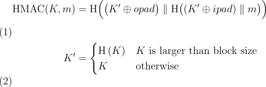

# Week 4 Exercises

This week’s exercises focus on stream ciphers and hash functions. We briefly touch the topic of MACs on the final task, which is the main theme of the following week.

Stream ciphers and hashes are in the course book on the pages 77-126. 

## Grading

You are eligible for following points from the exercise. Previous task(s) should be completed before going further.

Task #|Grade|Description|
-----|:---:|-----------|
Task 1 | 1 | Stream cipher usage
Task 2 | 2 | Partial collisions and preimages of hash functions
Task 3 | 3 | Nonce reuse
Task 4 | 4 | MACs gone wrong

## Task 1: Stream cipher usage

Select a stream cipher and encrypt some text with the generated keystream by XORing the keystream to the plaintext.

**1.1.** Take the plaintext from Week 3 exercises task 3: "Move the tables to the patio as soon as possible!" and encrypt it with the keystream. Generate a ciphertext that will decrypt to "Move the chairs to the house as soon as possible!" under the same keystream (remember ASCII encoding etc.). Remember that we are forging a new ciphertext that can be decrypted with the original key/nonce. Is there something similar in ciphertexts? Why/why not?

**1.2.** Encrypt a message of your choice with a key and a nonce of your choice. Use another key and the same nonce to encrypt another, slightly different message of your choice, e.g. change one letter to another. Can you spot any pattern in the cipher texts? Can you get any relation between the plaintexts out of the ciphertexts?

**1.3.** Compare the encryption speed/time of AES-CBC, AES-CTR and the stream cipher of your choice. Which is most efficient? Is the difference great? Does your pc have hardware support for encryption? Note that a very little data size causes results to be highly affected by system noise.

> Return possible source code and answer the questions.

## Task 2: Partial collisions and preimages of hash functions

This task focuses on collision and preimage attacks on hash functions. Take a look on course book, page 105 onwards.

**2.1** Implement a partial collision search for different hash functions (MD5, SHA-1, SHA-3 etc.). Find partially colliding messages for 2-4 first bytes of the hash value. Report the colliding messages and the time it took to find a collision.

**2.2** Implement a partial preimage search for some hash function (MD5, SHA-1…). Find preimages for hash values starting with 1-3 zero bytes. Report the preimages along with the time it took to find them.

**2.3** Compare the computation and memory requirements of your implementations. If you are working on with Python, you can use for example Python module [memory_profiler](https://github.com/pythonprofilers/memory_profiler) for computing memory usage. For computation performance, CLI utility `time` command could be enough. For more advanced analysis build-in tool [cProfile](https://docs.python.org/3/library/profile.html) can be useful, but stripping non-meaningful data is required.

> Return possible source code and answer the questions. If you are using profilers, it might be reasonable to include tables. Remember to write down the original and collided messages as well as their hashes.
| Original Message | Colliding message | Original Hash | Colliding hash |
|------------------|-------------------|---------------|----------------|
|                  |                   |               |                |

Note that for example the Bitcoin proof-of-work algorithm is based on a partial preimage search of a hash function.

## Task 3: Nonce reuse

Alice wants to send Bob some longer text. She cuts text to separate messages of 50 characters and encrypts those messages separately. For encryption she uses secure stream cipher and only she and Bob know the key. Alice also carefully picks random nonce for messaging.

Sadly one thing goes wrong: Alice forgets to get new random nonce for the each message. *Uh-oh*

File *files/task3_messages.txt* contains first 10 captured ciphertexts Alice has sent to Bob. Each ciphertext is on its own row.

Next things are known:
* Message content
  * Message has 8-bit ASCII encoding(ASCII is 7-bit encoding but it happens to be easier to handle full bytes and it does not matter in this task so easier way is taken).
  * Message can contain all lowercase letters and spaces. No other characters or special characters are used.
  * Alice has cutten text to pieces as-it-is for example without caring to keep words uncutted
  * Language of message is english
* Encryption
  * Alice uses secure stream cipher with randomly selected nonce and key only known by her and Bob. Bruteforcing messages by guessing nonce and key to get correct keystream is not possible.
  * Usually nonce is attached to sent message but we have cutten it out from material. You shall survive without it.
  * Encryption is made by basic way of XORing keystream and plaintext. As we have 8-bit characters, encrypted text will be nice hexadecimal numbers, each byte in plaintext corresponding byte in ciphertext, for example 'abcd' => *encryption* => '1f2e3d4c'

Your task is to find out what Alice has sent to Bob. Good luck!

**Task 3.1** Return solved messages. It does not have to be perfect, but aim for at least 90% accuracy. Return description what you did and code or other tools you used. Also explain shortly why your solution works. Have you seen this text before?

**Task 3.2** Let's say that Alice has only sent 2 message to Bob with same flaw described in this task. Can you solve content then? If yes, then explain how or what limitations apply. If no, then explain why it is impossible or unfeasible.

**Task 3.3** All messages in this task have same length. What happens when messages have differing lengths? Can you solve content then? If yes, then explain how or what limitations apply. If no, then explain why it is impossible or unfeasible.


## Task 4: MACs gone wrong

> This task might be quite challenging, depending on your technical background. However, we try to focus on the cryptographic part here, while still bringing the example of whole partial system.

### Preface

Bob has been busy. He has been working on his side project; a web app where he is testing "new" method for maintaining user authentication with HTTP cookies on the website. He is using `sha256` hashes as message authentication codes ([MAC](https://en.wikipedia.org/wiki/Message_authentication_code)s) of the cookie content with included random prefix key, as secure method to be sure, that only his backend server can be the origin of them. 
Once he is satisfied on his work from the login part, he asks his friend, Alice who is much more experienced on this matter, to check on his work. He is going to open-source his work.

You can find the source code from the [app](app) directory.
We are only interested in about the backend code in practice (Python files).

Alice quickly notices that there are few implementation problems on the code. One is, that *security assumption of `sha256` hashes as secure signature on authentication on this case is wrong,* even thought it is one of the most used hashing algorithms. Hash algorithms in *Merkle–Damgård* family are vulnerable on [length extension attack.](https://en.wikipedia.org/wiki/Length_extension_attack) One could add more data on top of existing data, and calculate new valid hash, as long as the content length and old hash of the existing data is known, regardless if the old content data is unknown. The implementation fails here, when random prefix data is simply included with the actual data, before calculating the hash. See [security.py](app/security.py)

However, it could be secure, when implemented correctly. See reference for [HMAC](https://docs.python-requests.org/en/master/user/advanced/#session-objects):



Pages 124-133 from the course book are related on this matter. There will be more about MACs in the following week.

### Length extension attack

At first, badly selected hashing algorithm did not sound **that** bad, there is another flaw on the source code (see `security.py`) on `parse_session` method: it might not be perfect on parsing the cookie, and with combination of bad security assumptions for this case, it can lead for unexpected things. 

**The task here** is to implement length extension attack on the web application, by modifying authentication cookie. **Can you access the route `/admin/top-secret` by only modifying the cookie of the guest user?**

In this case, we have access for hashed password (or secret,) of the admin user, which still should be normally unusable for authentication because of the signature checks.

> You should return source code and shortly explain main mechanic on here; what you did. **You can use existing tools for calculating new signatures.** Implementing own code for extending hash value with new data could be very challenging. You can get partial grade by reporting everything what you tried, even if it was not fully successful.

**Disclaimer:** don't use app as example for many cases. For password hashing, proper algorithm such as [Argon2](https://en.wikipedia.org/wiki/Argon2) with salting should be used, which resists brute forcing.

### Some general tips for the task

To set application running on your local machine, there is available `Docker` image. To simply start the application, run:
```console
docker run --rm -p 127.0.0.1:5000:5000 ghcr.io/ouspg/crypto-length-extension-atc
```

Then it is available on the url `localhost:5000`.

Docker has been installed on the provided virtual machine.

If you are working on Python code, see [`requests`](https://docs.python-requests.org/en/master/) library for handling HTTP requests. [Session objects](https://docs.python-requests.org/en/master/user/advanced/#session-objects) could be useful on handling and accessing cookies.
